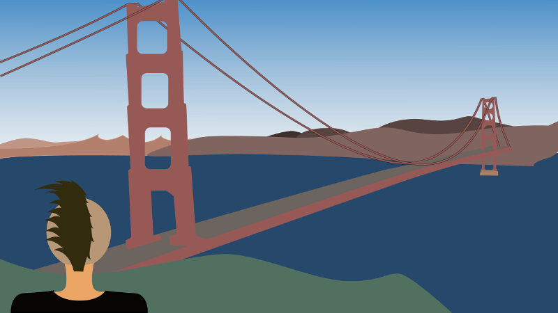

= Greatest Reactive Wallpaper

The greatest wallpaper for people who love reactive programming

== The Wallpaper

== Features

* great wallpaper released during http://blog.thomasbelin.fr/talks/reactive-programming/[a real (and nice) conference about Reactive Programming]
* scalable, 19:8 ratio (approximately)
* lightweight (346 kB only!)
* suitable for colorblind people
* not suitable for blind people
* suitable for PHP developers
* printable on a paper (to impress your friends AFK)
* not suitable for people who love yellow (or physics)

== License and legal stuff

This wallpaper actually belongs to https://twitter.com/atomrc[@atomrc].

You can send him money, food or small cute animals.
